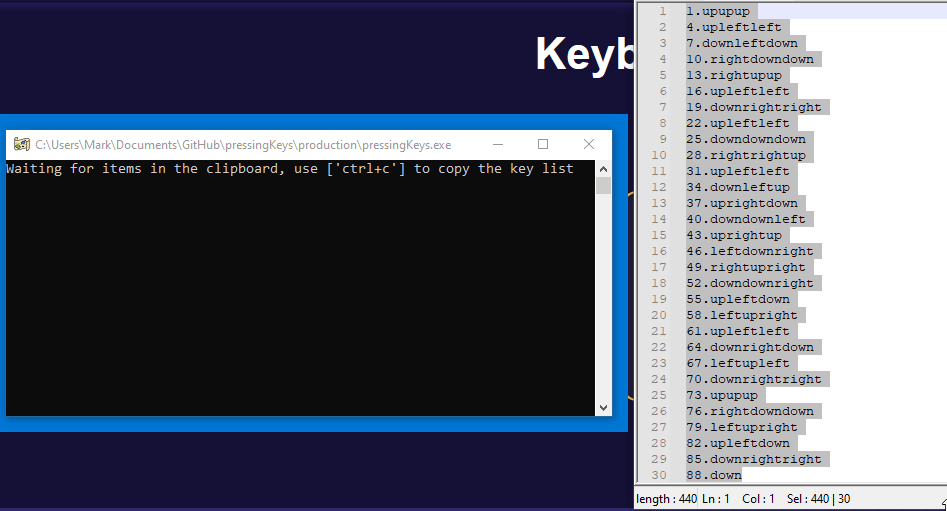

# pressingKeys
This is a program to press keys given a text file.

## Usage 
Download the [pressingKeys.exe](https://github.com/marcoagbarreto/pressingKeys/releases/download/v0.2.0/pressingKeys.exe) from releases:

or clone the repository (no installation required, source files are sufficient):
        
    https://github.com/marcoagbarreto/pressingKeys.git

dependencies:

    import os
    import time
    import keyboard
    import random
    import numpy as np
    import re
    import pyperclip

or [download and extract the zip](https://github.com/marcoagbarreto/pressingKeys/archive/main.zip) into your project folder.

## Example

1. Run ```pressingKeys.exe``` or ```pressingKeys.py```
2. Copy the key list with ```[Ctrl+C]```
3. Make focus on the desired app.
4. Press ```[Ctrl]``` to run the program.
5. Profit.
6. Restart the program with ```[Shift]```

You can find a ```"keyList.txt"``` in this repo that you can use for testing.

With the current settings:
100 keys = 10+- 5s



## Known limitations:
* Reducing time intervals will result in keystrokes missing.
* Current version only supports arrow keys.
* Input formatting should look like this:

``` notepadd++
    1.upupup
    4.upleftleft
    7.downleftdown
    10.rightdowndown
    13.rightupup
```